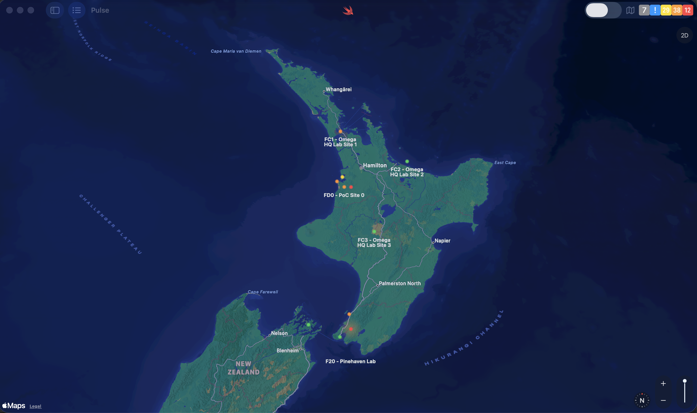
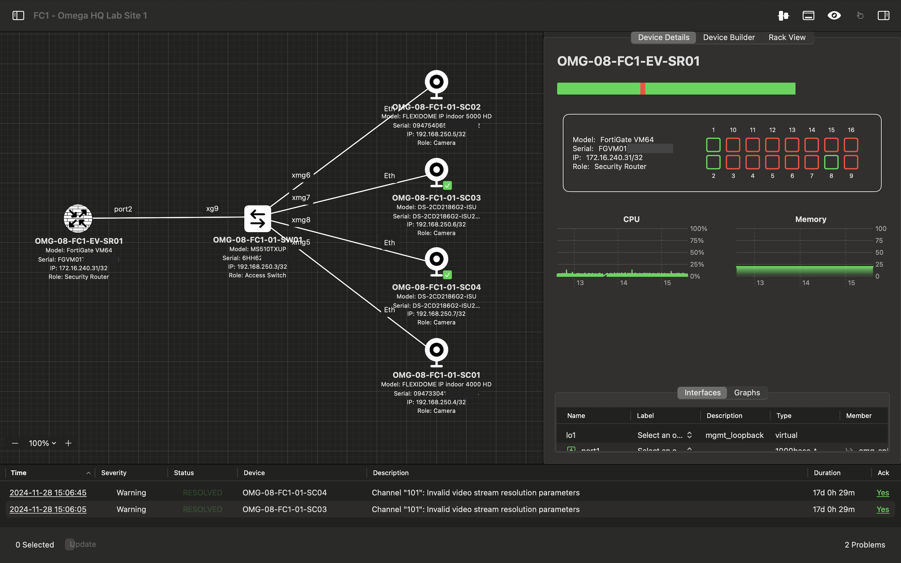
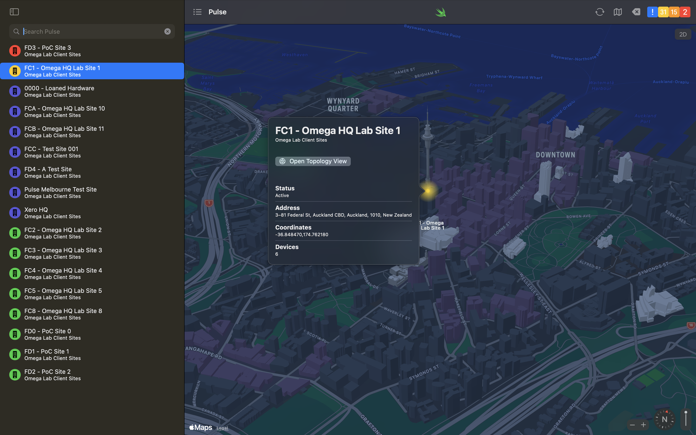
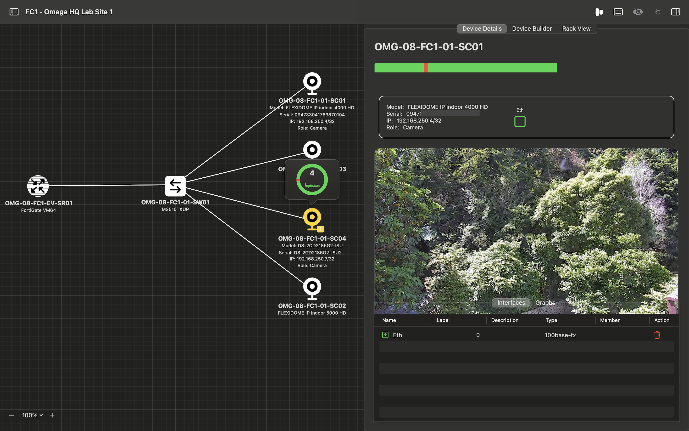

<div align="center">
  
  <p><strong>The Platform for Unified Leadership in Smart Environments</strong></p>
  <a href="https://github.com/omega-networks/pulse/blob/main/LICENSE"></a>
  <a href="https://github.com/omega-networks/pulse/graphs/contributors"></a>
  <a href="https://github.com/omega-networks/pulse/stargazers"></a>
  <p>
    <strong><a href="https://omega.net.nz">Omega Networks</a></strong> |
    <strong><a href="https://github.com/omega-networks/pulse/wiki">Documentation</a></strong> |
    <strong><a href="mailto:innovate@omega.net.nz">Contact</a></strong>
  </p>
</div>

Pulse unifies your infrastructure into a single, real-time digital twin. See every network device, monitor critical systems, and analyze historical patterns - all from one native Apple application. Pulse transforms siloed infrastructure data into actionable intelligence while maintaining complete local control.

<p align="center">
  <a href="#capabilities">Capabilities</a> |
  <a href="#requirements">Requirements</a> |
  <a href="#getting-started">Getting Started</a> |
  <a href="docs/media/pulse_architecture_diagram.md">Architecture</a> |
  <a href="#contributing">Contributing</a>
</p>

## What Pulse Does

### Unified Infrastructure Visualization
Pulse connects to your existing NetBox instance to create an interactive digital twin of your infrastructure. See all devices, connections, and dependencies in real-time 2D visualizations and 3D maps. During outages or emergencies, instantly understand impact, scope and affected systems.

<div align="center">
  
  <p><em>Geographic visualization of infrastructure sites across New Zealand</em></p>
</div>

### Real-Time Monitoring Integration
Through Zabbix integration, Pulse displays live status for every device, with automatic alerting and historical analysis. Track patterns, identify recurring issues, and predict failures before they impact services.

<div align="center">
  
  <p><em>Detailed network topology with real-time device monitoring and performance metrics</em></p>
</div>

### Cross-Boundary Coordination
When disasters strike, jurisdictional boundaries become irrelevant. Pulse enables secure, controlled information sharing between organizations - councils can coordinate with utilities, emergency services can see critical infrastructure status, and communities can work together while maintaining data sovereignty.

### Local Processing, Local Control
All data processing happens on your hardware. No cloud dependencies, no external vulnerabilities, no vendor lock-in. Run Pulse on as little as a Mac mini or iPhone, scaling up as your needs grow.

### Secure Device Access
Connect to network devices over SSH without leaving Pulse. Credentials are backed by the device's Secure Enclave (biometry or passcode gated, non-exportable), host keys are pinned on first use (TOFU) with an explicit mismatch flow, and sessions can be recorded to an encrypted, tamper-evident log. See the [User Guide](docs/user-guide.md) and [SSH credentials guide](docs/credentials.md) for details. The operator terminal is macOS today. Operators can also open a device's web management interface in-app (the Web companion): the URL is derived from the device's NetBox services, and self-signed certificates are trusted per-host through an operator prompt. See the [Web companion guide](docs/web-companion.md).

## Capabilities

- ✅ NetBox integration for infrastructure visualization, incremental sync, and writes back to NetBox
- ✅ Zabbix monitoring with real-time status updates
- ✅ Historical data analysis and pattern recognition
- ✅ 2D/3D topology visualization
- ✅ macOS native application
- ✅ iOS/iPadOS support
- ✅ Secure SSH terminal: Secure Enclave-backed credentials, host-key (TOFU) trust, and encrypted session recording (macOS)
- ✅ In-app Device Web companion: a device's web UI resolved from its NetBox service, with per-host TLS trust for self-signed certificates (macOS)

### Advanced Site Management
Drill down from geographic overview to detailed site topology, including network diagrams, device configurations, live camera feeds, and comprehensive monitoring data.

<div align="center">
  
  <p><em>Site selection with detailed information and topology access</em></p>
</div>

<div align="center">
  
  <p><em>Individual device monitoring with live camera feeds and network interface details</em></p>
</div>

## Requirements
- **Hardware**: Apple Silicon Mac mini (M1 or later) OR iPhone/iPad
- **Software**: macOS 26+ / iOS 26+ / iPadOS 26+ - limited support for previous versions
- **Infrastructure**: NetBox instance (for asset management) and/or Zabbix (for monitoring)

## Getting Started

### Prerequisites

Before you begin, make sure you have:

- **Mac computer** running macOS 26 or later
- **Xcode 26 or later** installed (free from Mac App Store)
- **Apple Developer account** (free account is sufficient for development)
- **Git** installed (comes with Xcode Command Line Tools)
- **Infrastructure** (optional): NetBox instance and Zabbix monitoring system

**Estimated setup time:** Approximately 1 hour for first-time setup

---

### Quick Start

For experienced developers, here's the quick version:

1. Clone the repository
```bash
   git clone https://github.com/omega-networks/pulse.git
   cd pulse
   git config core.hooksPath .githooks
```

2. Configure build settings
```bash
   cp Development.xcconfig.template Development.xcconfig
```

3. Edit `Development.xcconfig` with your team-specific values:
```
   DEVELOPMENT_TEAM = YOUR_TEAM_ID_HERE
   BUNDLE_IDENTIFIER = com.yourorg.pulse
```

4. Open and build
   - Open `Pulse.xcodeproj` in Xcode 26+
   - Do **not** pick a Team in Signing & Capabilities — that writes your
     Team ID into the shared project file. Signing reads `DEVELOPMENT_TEAM`
     from `Development.xcconfig`.
   - Build and run (⌘+R)

5. Configure data sources
   - Add your NetBox endpoint URL
   - Configure Zabbix monitoring credentials

For detailed step-by-step instructions, continue reading below.

---

### Detailed Setup Instructions

#### Step 1: Clone the Repository

Open **Terminal** (found in Applications → Utilities) and run:

```bash
git clone https://github.com/omega-networks/pulse.git
cd pulse
```

**What this does:** Downloads the Pulse code to your computer and navigates into the project folder.

**Don't have Git installed?**
- Git comes with Xcode Command Line Tools
- If prompted, type: `xcode-select --install`

---

#### Step 2: Configure Build Settings

Still in Terminal, run:

```bash
cp Development.xcconfig.template Development.xcconfig
```

**What this does:** Creates your personal configuration file from the template. This file will contain your Apple Developer settings and won't be committed to Git.

---

#### Step 3: Find Your Apple Developer Configuration Values

Before editing the configuration file, you need to gather two pieces of information from your Apple Developer account.

##### A. Find Your Team ID

Your Team ID is a 10-character code that identifies your Apple Developer account.

**How to find it on the Apple Developer Portal:**
1. Visit [developer.apple.com](https://developer.apple.com)
2. Sign in with your Apple ID
3. Go to **Account → Membership Details**
4. Your **Team ID** is listed there

##### B. Create Your Bundle Identifier

Your bundle identifier uniquely identifies your app.

**Step-by-step:**

1. Go to [developer.apple.com](https://developer.apple.com)
2. Navigate to **Certificates, Identifiers & Profiles**
3. Click **Identifiers** in the left sidebar
4. Click the **+** button next to Identifiers
5. Select **App IDs**
6. Click **Continue**
7. Select **App** (not App Clip)
8. Click **Continue**
9. Enter a description: **"Pulse Platform"**
10. Enter your Bundle ID using one of these formats:
    - Match your actual domain: `nz.govt.yourorg.pulse` or `com.yourorg.pulse`
    - Simplified format: `yourorg.pulse`
    
    **Example for Omega Networks:**
    - `omega-networks.Pulse`
    
    **Other examples:**
    - `yourorg.pulse`
    - `com.yourorg.pulse`
    
    **Naming tip:** Choose a bundle identifier that makes sense for your organisation.

11. Click **Continue** then **Register**

---

#### Step 4: Edit Your Configuration File

Now you'll add your two values to the configuration file.

##### Option A: Using a Text Editor (Recommended for Beginners)

1. In **Finder**, navigate to the `pulse` folder you just cloned
2. Find the file called `Development.xcconfig`
3. Right-click on it and choose **Open With → TextEdit**
4. You need to replace TWO values:
   
   **Line 1 - Team ID:**
   ```
   DEVELOPMENT_TEAM = YOUR_TEAM_ID_HERE
   ```
   Replace `YOUR_TEAM_ID_HERE` with your Team ID (e.g., `ABCDE12345`)
   
   **Line 2 - Bundle Identifier:**
   ```
   BUNDLE_IDENTIFIER = com.yourorg.pulse
   ```
   Replace with your bundle ID (e.g., `omega-networks.Pulse` or `nz.govt.wellington.pulse`)

5. **Save the file** (⌘+S)

##### Option B: Using Terminal

```bash
nano Development.xcconfig
```

1. Use arrow keys to navigate through the file
2. Replace these TWO values:
   - `YOUR_TEAM_ID_HERE` → Your Team ID (e.g., `ABCDE12345`)
   - `com.yourorg.pulse` → Your bundle identifier (e.g., `omega-networks.Pulse` or `nz.govt.wellington.pulse`)
3. Press **Control+X** to exit
4. Press **Y** to save changes
5. Press **Enter** to confirm

**Your completed file should look like:**

```xcconfig
// Apple Developer Team ID - find this in your Apple Developer account
DEVELOPMENT_TEAM = ABCDE12345

// Base bundle identifier for your app
BUNDLE_IDENTIFIER = omega-networks.Pulse
```

**Replace these with YOUR actual values:**
- `ABCDE12345` with your Team ID
- `omega-networks.Pulse` with your Bundle ID

---

#### Step 5: Open and Build the Project

##### A. Open in Xcode

1. In **Finder**, navigate to your `pulse` folder
2. Double-click on **`Pulse.xcodeproj`**
3. Xcode will open the project

**Alternative:** In Terminal, from the pulse folder, run:
```bash
open Pulse.xcodeproj
```

##### B. Signing

Signing comes from `Development.xcconfig` (`DEVELOPMENT_TEAM` and `BUNDLE_IDENTIFIER`). Do **not** choose a Team under **Signing & Capabilities** — Xcode then writes the literal Team ID into `project.pbxproj`, which must stay templated for the public repo.

If Xcode has dirtied `Pulse.xcodeproj/project.pbxproj` after Archive or opening Signing, restore it:

```bash
git checkout -- Pulse.xcodeproj/project.pbxproj
```

**If you see a signing error:**
- Confirm `DEVELOPMENT_TEAM` and `BUNDLE_IDENTIFIER` in `Development.xcconfig`
- Make sure you're connected to the internet
- Verify **"Automatically manage signing"** is checked
- Make sure your Bundle Identifier matches what's registered in the Apple Developer Portal (case sensitive)

##### C. Build and Run

1. At the top of Xcode, select a destination:
   - For Mac: Select **"My Mac"**
   - For iPhone/iPad: Connect your device and select it, or choose a simulator
2. Click the **Play button** (▶) in the top-left corner, or press **⌘+R**
3. Xcode will build the app (this may take a few minutes the first time)
4. If successful, the Pulse app will launch

**First build may take 5-10 minutes** as Xcode downloads dependencies and compiles everything.

---

#### Step 6: Configure Data Sources

Once Pulse is running, you need to connect it to your infrastructure monitoring systems.

##### A. Add NetBox Endpoint

NetBox is your source of truth for infrastructure inventory.

1. In the Pulse app, go to **Pulse** then **Settings**
2. Find the **NetBox Settings** section
3. Enter your NetBox URL under **API Server** (e.g., `https://netbox.yourdomain.com`)
4. Enter your **API token**
   - Obtain this from your NetBox administrator
   - Or create one in NetBox: Admin → API Tokens → Add
   - Enter User for permissions then copy the Key
   - Click **Create**
   - Paste the key into Pulse
5. Click **Apply Settings**
6. Pulse will test the connection and sync your infrastructure data

##### B. Configure Zabbix Monitoring

Zabbix provides real-time monitoring metrics.

1. In the Pulse app, go to **Pulse** then **Settings**
2. Find the **Zabbix Settings** section
3. Enter your Zabbix server URL under **API Server** (e.g., `https://zabbix.yourdomain.com`)
4. Enter your username and password under **API User** and **API Token** respectively
5. Click **Apply Settings**
6. Pulse will begin pulling monitoring data

---

### Troubleshooting

#### "No such module" Errors

**Problem:** Xcode can't find required dependencies.

**Solution:**
1. In Xcode, go to **File → Packages → Resolve Package Versions**
2. Wait for packages to download
3. Try building again (⌘+B)

#### Signing Errors

**Problem:** "Failed to register bundle identifier" or similar signing errors.

**Solution:**
1. Verify your Team ID is correct in `Development.xcconfig` — do not set Team in the Xcode GUI
2. Make sure you're connected to the internet
3. Verify your Bundle Identifier matches exactly what's registered in the Apple Developer Portal (including capitalization)
4. If the bundle identifier shows as "not available", you need to register it in the Apple Developer Portal first

#### Build Takes Forever

**Problem:** First build is taking an extremely long time.

**Solution:**
- First builds can take 10-15 minutes - this is normal
- Xcode is downloading dependencies and compiling everything
- Check the progress in the top center of the Xcode window
- If it's genuinely stuck, press **⌘+.** to stop, then try again

#### NetBox Connection Failed

**Problem:** Can't connect to NetBox.

**Solution:**
1. Verify the NetBox URL is correct and accessible from your network
2. Check that your API token is valid
   - Test it in NetBox web interface: User menu → API Tokens
3. Ensure your NetBox instance allows API access
4. Check firewall rules if NetBox is on a private network

#### Zabbix Connection Issues

**Problem:** Can't connect to Zabbix.

**Solution:**
1. Verify Zabbix URL is correct and reachable
2. Check username and password
3. Verify your user has sufficient permissions in Zabbix (ensure API access is enabled)

---

### Common Questions

**Q: Do I need a paid Apple Developer account?**

A: No, a free account works for development and testing. You only need a paid account ($149 NZD/year) to distribute apps on the App Store.

**Q: Can I run Pulse on Windows or Linux?**

A: No, Pulse is a macOS/iOS application and requires macOS and Xcode to build and run.

**Q: Where is my data stored?**

A: Pulse stores all data locally on your Mac with no cloud synchronization. Your infrastructure monitoring data comes from your NetBox and Zabbix servers - Pulse queries it in real-time and keeps a local cache. No data is sent to external cloud services.

**Q: Can multiple people use the same Pulse deployment?**

A: Yes, each person follows these setup instructions with their own Apple Developer account. They all connect to the shared NetBox and Zabbix servers. Each person maintains their own local cache and app state.

**Q: Do I need both NetBox and Zabbix?**

A: NetBox is required for infrastructure inventory. Zabbix is optional but recommended for real-time monitoring.

---

### Next Steps

Once Pulse is running:

1. **Explore the interface** - Familiarise yourself with the monitoring dashboard
2. **Add devices** - Connect your infrastructure devices through NetBox
3. **Configure monitoring & alerting** - Assign templates to your devices for monitoring data and notifications for events in Zabbix

Day-to-day use is in the [User guide](docs/user-guide.md).

---

## Documentation

- [User guide](docs/user-guide.md): day-to-day use, NetBox sync, racks, seats, and SSH.
- [SSH credentials](docs/credentials.md): Secure Enclave keys, host trust, and session recording.
- [Web companion](docs/web-companion.md): in-app device web UI and TLS trust.
- [NetBox sync](docs/netbox-sync.md): how Pulse mirrors NetBox and writes back.
- [SSH and web foundations](docs/architecture/0001-ssh-terminal-and-web-foundations.md): credential, trust, and session-recording model.
- [Billing and distribution](docs/architecture/0002-billing-and-distribution.md): App Store seats and subscription caps.
- [NetBox OpenAPI sync](docs/architecture/0003-netbox-openapi-sync.md): how the local twin is built from NetBox.
- [Architecture diagram](docs/media/pulse_architecture_diagram.md): high-level data flow.

## Contributing

Pulse thrives on the triadic relationship between Industry, Academia, and Community:

- **Industry**: Deploy Pulse for operational resilience and contribute enterprise-grade improvements
- **Academia**: Research new capabilities and validate approaches through real-world testing
- **Community**: Provide use cases, feedback, and local knowledge that shapes development

Contributions are welcome via issues and pull requests.

Pulse is open source and sponsor-supported. If it's useful to you, consider [sponsoring](https://github.com/sponsors/Omega-Networks).

## License

GNU Affero General Public License (AGPL-3.0) - see [LICENSE](LICENSE)

For commercial licensing inquiries, contact innovate@omega.net.nz

---

**Built with purpose by [Omega Networks](https://omega.net.nz)**  
**Contact**: innovate@omega.net.nz  
**Location**: Wellington, New Zealand