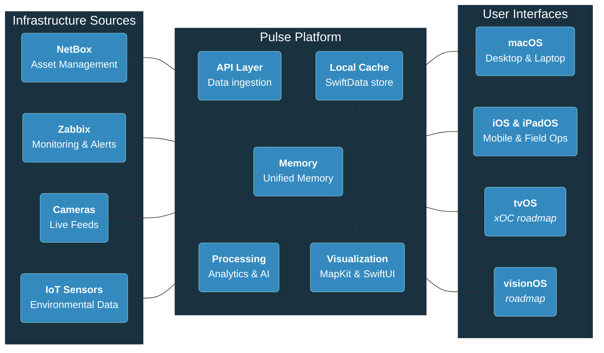

# Pulse: Unified Infrastructure Platform Architecture

## Understanding the Architecture

### How to Read This Diagram

This diagram shows the three key layers of the Pulse platform and how data flows between them:

**Left to Right Data Flow:**
1. **Infrastructure Sources** (left) → **Pulse Platform** (center) → **User Interfaces** (right)
2. Data is collected from your existing systems, processed and unified, then presented through native Apple interfaces

### Component Details

<strong>Infrastructure Sources (Input Layer)</strong>

These are your existing systems that Pulse connects to:
- **NetBox**: Provides device inventory, network topology, and asset management data
- **Zabbix**: Supplies real-time monitoring data, alerts, and performance metrics
- **Cameras**: Streams live video feeds for security and operational monitoring
- **IoT Sensors**: Delivers environmental data like temperature, humidity, and power usage

<strong>Pulse Platform (Processing Layer)</strong>

The core engine that transforms raw data into actionable insights:
- **API Layer**: Handles secure communication with all data sources using their native APIs
- **Local Cache**: SwiftData-powered local storage for fast access and offline operation
- **Unified Memory**: In-memory data structures that create a single coherent view of your infrastructure
- **Processing Engine**: Local analytics and AI that detect patterns, anomalies, and generate insights
- **Visualization Layer**: Renders data into maps, charts, and interactive displays using MapKit and SwiftUI

<strong>User Interfaces (Output Layer)</strong>

Native Apple applications optimized for different use cases:
- **macOS**: Full desktop experience for detailed analysis and administration
- **iOS/iPadOS**: Mobile interface for field work and quick status checks
- **tvOS**: Large-screen dashboards for operations centers (planned feature)
- **visionOS**: 3D infrastructure visualization (future roadmap)

### Architecture Characteristics

**Local-First Design**: All processing happens on your devices - no data leaves your network unless you choose to sync between your own devices via CloudKit.

**Unified Memory Model**: Instead of querying multiple systems repeatedly, Pulse maintains a comprehensive in-memory model of your entire infrastructure that updates in real-time.

**Native Apple Integration**: Built specifically for Apple's ecosystem using SwiftUI, SwiftData, and platform-specific APIs for optimal performance and user experience.

## Architecture Principles & Impact Philosophy

| Technical Capability | Core Value | Community Benefit |
|---------------------|------------|-------------------|
| **🔒 No Cloud Dependencies** | **Self-Determination** | Complete data sovereignty and local control |
| **🌐 Unified Data Platform** | **Active Stewardship** | Comprehensive monitoring of community infrastructure |
| **🧠 Local Intelligence** | **Self-Sufficiency** | Independent analytics without external dependencies |
| **📱 Native Ecosystem** | **Unified Experience** | Seamless operations across all devices and contexts |
| **🔄 Extensible Design** | **Future-Thinking** | Adaptable platform serving current and future generations |
