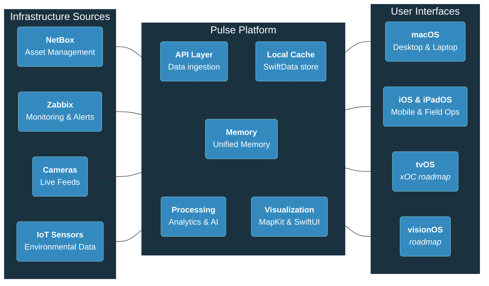

# Pulse: Unified Infrastructure Platform Architecture

## Architecture Principles & Impact Philosophy

| Technical Capability | Core Value | Community Benefit |
|---------------------|------------|-------------------|
| **🔒 No Cloud Dependencies** | **Self-Determination** | Complete data sovereignty and local control |
| **🌐 Unified Data Platform** | **Active Stewardship** | Comprehensive monitoring of community infrastructure |
| **🧠 Local Intelligence** | **Self-Sufficiency** | Independent analytics without external dependencies |
| **📱 Native Ecosystem** | **Unified Experience** | Seamless operations across all devices and contexts |
| **🔄 Extensible Design** | **Future-Thinking** | Adaptable platform serving current and future generations |
