# Pulse: Unified Infrastructure Platform Architecture

```mermaid
graph TB
    %% Infrastructure Sources
    subgraph Sources["📡 Infrastructure Sources"]
        NetBox["🏢 NetBox<br/>Asset Management<br/>Source of Truth"]
        Zabbix["📊 Zabbix<br/>Real-time Monitoring<br/>Status & Alerts"]
        Cameras["📹 Camera Systems<br/>Live Feeds<br/>Visual Verification"]
        IoT["🌡️ IoT Sensors<br/>Environmental Data<br/>Temperature, Power, etc."]
        Future["⚡ Future Sources<br/>SCADA, Building Mgmt<br/>Plugin Architecture"]
    end

    %% Pulse Core Platform
    subgraph PulseCore["🔥 Pulse Platform<br/>100% Local Processing • No Cloud Dependencies"]
        API["🔌 API Integration Layer<br/>Unified data ingestion & normalization"]
        Cache["💾 Local Data Cache<br/>SwiftData persistence & offline capability"]
        Engine["⚙️ Processing Engine<br/>Pattern recognition & anomaly detection"]
        AI["🧠 Local AI (MLX)<br/>On-device intelligence & predictions"]
        Viz["🎨 Visualization Engine<br/>MapKit, SceneKit, SwiftUI rendering"]
    end

    %% User Interfaces
    subgraph UIs["👥 User Interfaces"]
        macOS["🖥️ macOS App<br/>• Full featured desktop<br/>• 2D/3D visualization<br/>• Multi-monitor support"]
        iOS["📱 iOS/iPadOS<br/>• Mobile operations<br/>• Field response<br/>• Touch interface"]
        
        subgraph Capabilities["✨ Key Capabilities"]
            Cap1["✓ Geographic mapping"]
            Cap2["✓ Network topology"]
            Cap3["✓ Real-time alerts"]
            Cap4["✓ Historical analysis"]
            Cap5["✓ Cross-org sharing"]
            Cap6["✓ Emergency response"]
        end
        
        Future2["🥽 Coming Soon<br/>visionOS • tvOS"]
    end

    %% Data Flow Connections
    NetBox --> API
    Zabbix --> API
    Cameras --> API
    IoT --> API
    Future -.-> API

    %% Pulse Internal Flow
    API --> Cache
    Cache --> Engine
    Engine --> AI
    AI --> Viz

    %% Output to Interfaces
    Viz --> macOS
    Viz --> iOS
    Viz -.-> Future2

    %% Styling
    classDef sourceBox fill:#e3f2fd,stroke:#1976d2,stroke-width:2px
    classDef pulseBox fill:#fff3e0,stroke:#f57c00,stroke-width:3px
    classDef uiBox fill:#e8f5e9,stroke:#388e3c,stroke-width:2px
    classDef futureBox fill:#f5f5f5,stroke:#bdbdbd,stroke-width:2px,stroke-dasharray: 5 5
    classDef capBox fill:#f1f8e9,stroke:#689f38,stroke-width:1px

    class NetBox,Zabbix,Cameras,IoT sourceBox
    class API,Cache,Engine,AI,Viz pulseBox
    class macOS,iOS uiBox
    class Future,Future2 futureBox
    class Cap1,Cap2,Cap3,Cap4,Cap5,Cap6 capBox
```

## Architecture Principles

### 🔒 Zero Cloud Dependencies
- All processing happens locally on your hardware
- No external vulnerabilities or vendor lock-in
- Complete data sovereignty and control

### 🌐 Unified Data Ingestion
- Single platform for multiple infrastructure sources
- Normalized data model across all inputs
- Real-time synchronization and offline capability

### 🧠 Local Intelligence
- On-device AI/ML using Apple's MLX framework
- Pattern recognition and anomaly detection
- Predictive analytics without data leaving your environment

### 📱 Native Apple Experience
- Built with SwiftUI for optimal performance
- Leverages platform capabilities (MapKit, SceneKit)
- Consistent experience across all Apple devices

### 🔄 Extensible Architecture
- Plugin system for future data sources
- Modular design supporting new capabilities
- API-first approach for integration flexibility