# Pulse: Unified Infrastructure Platform Architecture

```mermaid
%%{init: {"theme": "base", "themeVariables": {"primaryColor": "#ffffff", "primaryTextColor": "#000000", "primaryBorderColor": "#cccccc", "lineColor": "#666666", "sectionBkColor": "#ffffff", "altSectionBkColor": "#f8f9fa", "gridColor": "#e0e0e0", "secondaryColor": "#ffffff", "tertiaryColor": "#ffffff", "clusterBkg": "transparent", "clusterBorder": "#cccccc", "edgeLabelBackground": "#ffffff"}}}%%
graph LR
    %% Infrastructure Sources
    subgraph Sources["📡 Infrastructure Sources"]
        NetBox["🏢 NetBox<br/><b>Asset Management</b>"]
        Zabbix["📊 Zabbix<br/><b>Monitoring & Alerts</b>"]
        Cameras["📹 Cameras<br/><b>Live Feeds</b>"]
        IoT["🌡️ IoT Sensors<br/><b>Environmental Data</b>"]
    end

    %% Pulse Core Platform  
    subgraph PulseCore["🔥 Pulse Platform<br/><b>100% Local Processing • No Cloud Dependencies</b>"]
        direction TB
        API["🔌 <b>API Layer</b><br/>Data ingestion"]
        Cache["💾 <b>Local Cache</b><br/>SwiftData store"] 
        Engine["⚙️ <b>Processing</b><br/>Analytics & AI"]
        Viz["🎨 <b>Visualization</b><br/>MapKit & SwiftUI"]
        
        API --> Cache
        Cache --> Engine  
        Engine --> Viz
    end

    %% User Interfaces
    subgraph UIs["👥 User Interfaces"]
        macOS["🖥️ <b>macOS</b><br/>Desktop & Multi-monitor"]
        iOS["📱 <b>iOS/iPadOS</b><br/>Mobile & Field Ops"]
    end

    %% Data Flow Connections
    NetBox --> API
    Zabbix --> API
    Cameras --> API
    IoT --> API

    %% Output to Interfaces
    Viz --> macOS
    Viz --> iOS

    %% Styling with darker text and rounded corners (Apple/SwiftUI style)
    classDef default fill:#ffffff,stroke:#cccccc,stroke-width:2px,color:#000000,rx:12,ry:12
    classDef sourceBox fill:#e3f2fd,stroke:#1976d2,stroke-width:2px,color:#000000,rx:12,ry:12
    classDef pulseBox fill:#fff3e0,stroke:#f57c00,stroke-width:3px,color:#000000,rx:12,ry:12
    classDef uiBox fill:#e8f5e9,stroke:#388e3c,stroke-width:2px,color:#000000,rx:12,ry:12

    class NetBox,Zabbix,Cameras,IoT sourceBox
    class API,Cache,Engine,Viz pulseBox
    class macOS,iOS uiBox
```

## Architecture Principles

### 🔒 No Cloud Dependencies
- All processing happens locally on your hardware
- No external cloud services or third-party data processing
- Complete data sovereignty and control over your infrastructure data

### 🌐 Unified Data Ingestion
- Single platform for multiple infrastructure sources
- Normalized data model across all inputs
- Real-time synchronization and offline capability

### 🧠 Local Intelligence
- On-device AI/ML using Apple's MLX framework
- Pattern recognition and anomaly detection
- Predictive analytics without data leaving your environment

### 📱 Native Apple Platform
- Optimized for Apple Silicon and Apple ecosystem
- Leverages platform capabilities (MapKit, SceneKit, SwiftUI)
- Consistent experience across macOS, iOS, and iPadOS

### 🔄 Extensible Architecture
- Plugin system for future data sources
- Modular design supporting new capabilities
- API-first approach for integration flexibility